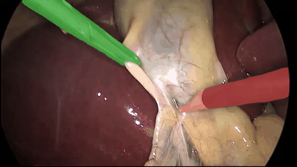
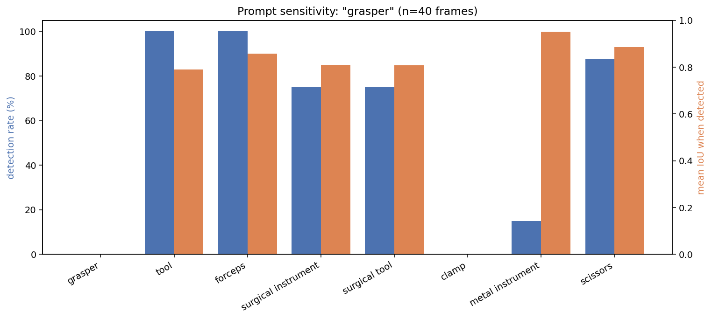
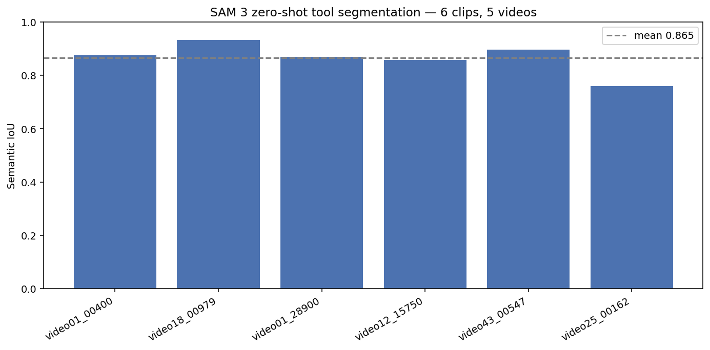
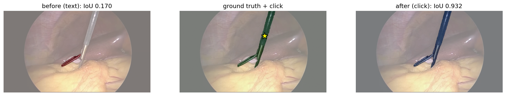

# Zero-Shot Video Segmentation & Tracking of Laparoscopic Surgery with SAM 3

Text-prompted video segmentation and temporal tracking of surgical instruments using Meta's **Segment Anything Model 3 (SAM 3)**, evaluated zero-shot on the **CholecSeg8k** laparoscopic cholecystectomy dataset.



## Overview

SAM 3 performs open-vocabulary segmentation from short text prompts, trained on natural images with no exposure to surgical data. This project measures how well that capability transfers, zero-shot, to laparoscopic video — detecting, segmenting, and tracking surgical instruments across frames from a text prompt, and benchmarking the masks against expert annotations.

## Results

| Metric | Result |
|---|---|
| Mean semantic IoU (6 clips) | 0.865 |
| Mean semantic Dice | 0.919 |
| Per-tool IoU | grasper 0.81, L-hook 0.83 |
| Two-instrument clip | IoU 0.932, stable identities across 80 frames |
| Interactive refinement | IoU 0.17 → 0.93 with one corrective click |

All results are zero-shot; SAM 3 was not fine-tuned on surgical data.

### Vocabulary is the bottleneck, not vision

Across 40 frames, the clinical term `"grasper"` detected the instrument 0% of the time, while the generic term `"tool"` detected it 100% — at equivalent mask quality once detected.



SAM 3's visual representations transfer to surgical imagery; its lexical grounding does not. Specialist terminology falls outside the model's training distribution. Mask quality is prompt-independent once an object is detected (IoU 0.79–0.89 across working prompts), so the gap is one of recognition, not segmentation.

### Benchmark across clips



Six clips spanning five surgical videos. The 0.76–0.93 spread reflects frame difficulty — partial occlusion and instruments entering frame — rather than model inconsistency.

### Interactive refinement

When text-tracking under-segments, a single corrective click recovers the mask via SAM 3's visual-prompt mode.



## Approach

1. **Data pipeline** — decode CholecSeg8k watershed masks into per-class tool masks; reconstruct 80-frame clips.
2. **Image segmentation** (`Sam3ImageSegmenter`) — text-prompted Promptable Concept Segmentation on single frames.
3. **Video tracking** (`Sam3VideoTracker`) — memory-bank tracker maintaining object identities across frames from a text prompt.
4. **Evaluation** — per-class region metrics (IoU, Dice, precision, recall) against expert annotations.
5. **Refinement** (`Sam3ClickRefiner`) — click-based correction of under-segmented masks.

## Tech stack

Python · PyTorch · SAM 3 · OpenCV · NumPy · Hugging Face Hub · pytest

## Setup

```bash
git clone https://github.com/shivamaiprojects/SAM3_surgical_tracking.git
cd SAM3_surgical_tracking
python -m venv .venv
pip install torch torchvision --index-url https://download.pytorch.org/whl/cu124
pip install -e ".[dev]"

git clone https://github.com/facebookresearch/sam3.git external/sam3
pip install -e external/sam3 einops "transformers>=5.13" kernels
```

SAM 3 checkpoints are gated; request access on Hugging Face and authenticate before running. Model inference requires a GPU (~8 GB VRAM). SAM 3 pins `numpy<2`, which constrains OpenCV and SciPy versions.

## Repository structure
```
src/sam3_seg/    installable package: data, models, evaluation, refinement
scripts/         CLI entry points for tracking, evaluation, and ablation
tests/           unit tests for the mask decoder and metrics
configs/         configuration files
docs/            result figures
```